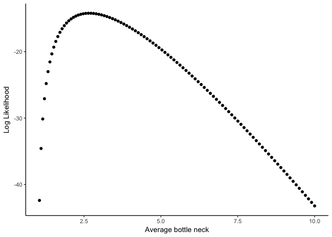
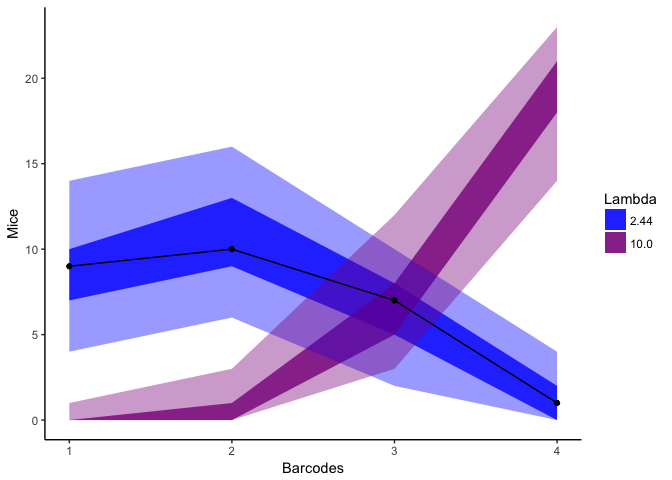
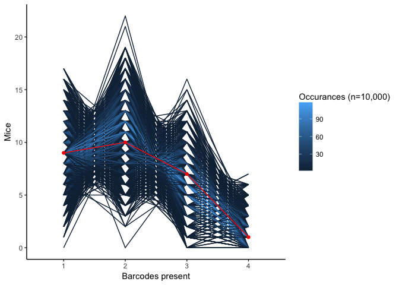
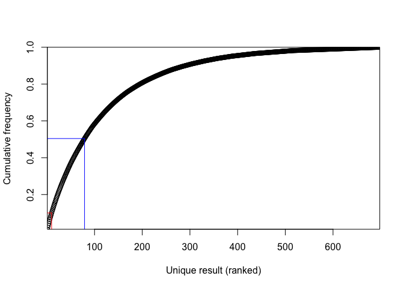
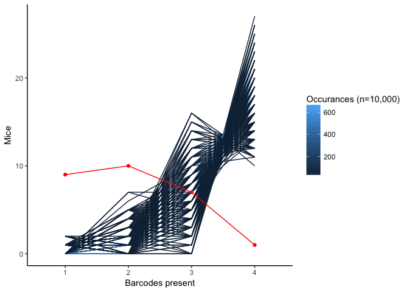
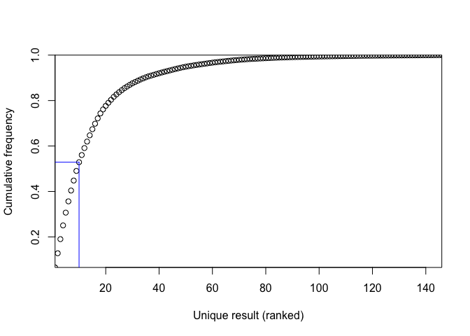

Estimating the within host bottleneck of polio virus
================

We are interested in estimating the effective bottleneck that restricts polio populations between intramuscular infection and entry into the brain. We will use data provided in Pfeiffer JK and Kirkegaard K. 2006 and a simple probabilistic model to estimate this bottleneck. Pfiffer and Kirkegaard infected 27 mice with 2 × 107 PFU of polio virus (2-5 fold higher than the LD50). This population was tagged with 4 neutral bar codes present in equal concentrations. In separate experiments the authors showed that all 4 bar codes were present at the site of infection and that all four bar codes were capable of replicating simultaneously in the brain. However, rarely were all 4 bar codes present in the brain following infection suggesting the populations were subject to within host bottlenecks. Similar results were observed for IV and IP routes of infection. In fact IM appears to be the least stringent mode of infection.

To estimate the bottleneck between the site of infection and the brain, we modeled this bottleneck as a random sampling event. This assumption was justified as : 1) There is no evidence that a "jackpot" mutation is needed to enter the central nervous system. 2) The bar codes were been shown to be neutral. 3) The mice data show that all bar codes were equally likely to be present in the brain. We assumed that bottlenecks are distrubuted according to a zero truncated Poisson distrubution. This allowed slight variation between each mouse but required the bottleneck be greater than 0 in all cases. We then usedmaximum likelihood optimization to estimate the average within host bottleneck size.

The probability of a sample size of *n* containing *K* unique types given there are *N* total unique types available (all present at equal frequency) is given by

$$
P(K|N,n)={N \\choose k}\\bigg( \\frac{k}{N}\\bigg)^n 
\\Bigg\[ 1-\\sum\_{i=1}^{k-1}{k \\choose i}\\bigg(  \\frac{k-i}{k} \\bigg)^n(-1)^{i+1}  \\Bigg\]
$$

1.  Ross SM. 2010. A First Course in Probability. Prentice Hall. Pages 121-122

We are interested in the probability a subset of size *n* containing 1,2,3, or 4 barcodes (*K*) given 4 possible barcodes (*N*). In this case *n* represents the bottleneck size and in our model follows a zero truncated Poisson distribution. The likelihood of observing *k* barcodes given *λ* is

*L*(*λ*)=*P*(*K*|*λ*)=∑*n**P*(*K*|*N*, *n*)*P*(*n*|*λ*)

Where *P*(*k*|*N*, *n*) is our expression above and $P(n|\\lambda) = \\frac{\\lambda ^n}{(e^{n}-1)n!}$ or the probability of getting *n* out of zero truncated Poisson with a parameter *λ*. We approximated the infinite sum above with a partial sum of the first 100 terms as we expected a small bottleneck, and the probability of an *n* of 50 with *λ* = 100 is on the order of 10−10 and negligible.

We then searched for the *λ* that maximizesdthe sum of the log of this likelihood, which was calculated for each mouse.

    ## 
    ## Call:
    ## mle2(minuslogl = llpnk_comp, start = list(lambda = 3), data = list(N = 4, 
    ##     k = k, FUN = dzpois.v))
    ## 
    ## Coefficients:
    ##   lambda 
    ## 2.437512 
    ## 
    ## Log-likelihood: -14.2

    ##    2.5 %   97.5 % 
    ## 1.389683 3.824037

We found that a *λ* of 2.44 with a 95% confidence interval of (1.39 - 3.82) best fits the data. This corresponds to a mean bottleneck of 2.67

To test the fit we will run 10,000 simulations. Each simulation includes 27 mice and each mouse has bottleneck size drawn from a zero-truncated Poisson with an *λ* of 2.43. For illustration we will also simulate the data with an average bottleneck of 10.

Here we have plotted the output of the simulations. The shaded regions represent the area occupied by 95% of the simulations with the dark regions representing the interquantile range of the simulations.

We can see that our model fits the data very well.

We can also check the fit by asking how often do we see the exact same output as the data in our simulations. For example how often do we see 9 mice with 1 bar code, 10 with 2, 7 with 3 and 1 with 4.

Here we rank the possible outcomes in order of frequency of occurance and plot the cumulative frequency on the y axis. The blue line signifiest the top 50% most frequent outcomes. The red line signifies the particular outcome observed in the mouse experiment. This outcome is in the top 10% most frequently simulated outcomes. If the experiment was repeated with 27 mice again we would not necessisarily not the exact same result, but we would expect the results to be similar. The graphs above show that similar results are the most likely outcomes of the model.

Mean bottleneck = 10
====================

We do not replicate the data once in 10,000 simulation if we have an *λ* bottleneck of 10.

    ## NULL
